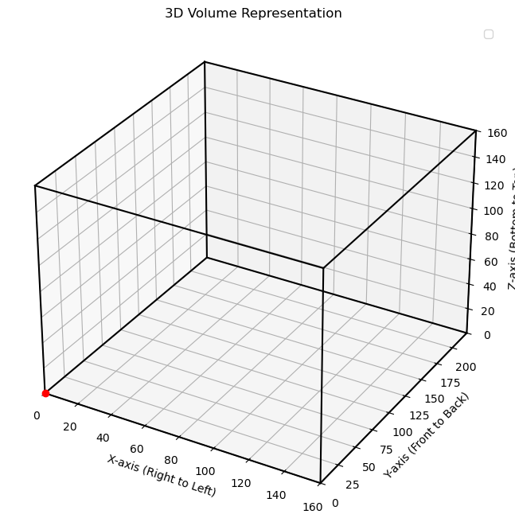
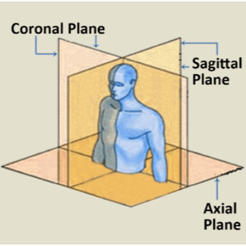

3D MRI EDA Summary

1. Structure and Layout of MRI Files

Some of the EDA in 3d_edge_detection.ipynb is focused on confirming the layout of the MRI images. This image shows the volume representation graphically. The volume is stored as a 3D numpy array with shape [Z, Y, X]. 

It's interesting to note that X-axis increases from right to left instead of left to right. This is radiological convention, since the left side of the image corresponds to the right side of the patient. Similarly, Y increases from front to back, and Z from bottom to top.

2. Boundary Detection

Boundary detection and isolation of the brain is done before the wavelet transform or any further testing. The background is made up of mainly 0 values, but there is some noise. Since we are not interested in fitting our model to the background and the noise present there, we should get rid of the values that may distort the brain's true distribution.

All of the boundary detection work is in 3d_edge_detection.ipynb. After understanding the structure of the MRI files (brainstem at Z = 0), I used a function to create a copy of the input file and add a plane at Z = 0 with a high-intensity value (5000). This seals the brain at the bottom because very low-value pixels or zeroes are sealed by the higher values. After sealing, binary_fill_holes can be used with satisfactory results. Then, the bottom plane is removed. The binary mask is created. This allows us to differentiate between brain values and background values. The background values are False, which is then assigned to NaN.

One note is that it is important to keep the datatype of the voxels in mind — they cannot be float16, they have to be float32 to maintain the NaNs. So if more work is done for preprocessing, I suggest running something similar to the histograms of the voxel values in the later part of 3d_edge_detection.ipynb. I used these histograms as a sanity check to ensure that the background (which we transformed from 0 + noise -> NaNs) stayed as NaNs and did not revert back to 0s at any point - this would undermine all the work done for boundary detection. 

The histograms plot the voxel values, so the images pre-cleaning have a large spike at 0 (for all of the background values). The cleaned voxel values do not have this spike, and the other features of the distribution remain the same as before. This intuitively makes sense, because we did not change anything about the distribution of the brain values - only the outside 0 values.

3. Jitter

Jittering is done to the images post-boundary detection. This is because we do not want to add random noise to the background when it is composed of 0's and small noise. Rather, we only want to add noise to the brain values, and we want to keep the background values as NaN. The jittering is done by adding uniform random noise before the wavelet (npz_opener_with_noise).

4. Orientation Dictionary

The dataframes in full3d_wavelet_eda.ipynb have labels for orientation that are a bit different from H (horizontal), V (vertical), D (diagonal) that we used for 2D images. They are composed of 3 characters, with each of the characters being either "d" (detail) or "a" (approximation).

This is standard wavelet transform convention and describes what the wavelet is looking at. The first character corresponds to the X axis (right->left aka sagittal), the second Y (front->back aka coronal), and the third Z (bottom->top aka axial). 

 *

Here are all the possible labels and what they mean. I suggest using the construction plane to visualize them spatially. 

aaa
- X smooth, Y smooth, Z smooth
- Coarse approximation of the brain volume

daa
- X high pass, Y smooth, Z smooth
- Sensitive to edges in the sagittal plane

ada
- X smooth, Y high pass, Z smooth
- Sensitive to edges in the coronal plane

aad
- X smooth, Y smooth, Z high pass
- Sensitive to edges in axial plane

dda
- X high pass, Y high pass, Z smooth
- Sensitive to angled transitions in sagittal and coronal

dad
- X high pass, Y smooth, Z high pass
- Sensitive to angled transitions in sagittal and axial

add
- X smooth, Y high pass, Z high pass
- Sensitive to angled transitions in coronal and axial

ddd
- X high pass, Y high pass, Z high pass
- Captures the fine structure across brain

5. Combining Directions for Testing - and why not

Looking at the KS stats and p-values for the wavelet 3D, it does not look promising to combine any directions. The KS stats are very large and the p-values are very small to the point where the distributions for each of the directions look different enough to keep seperate. 

Also, another reason for not combining any of the directions is because we did not merge them for the 2D MRI images. So in addition to the fact that the distributions look very different from each other, it would be good to keep them seperate for consistency as well. 

A final note on keeping the directions separate that we intuitively believe that each of the directions of the brain encode different information. Scanning the brain from front to back vs left to right should look different. 

** From https://pro.boehringer-ingelheim.com/us/ipfradiologyrounds/hrct-primer/image-reconstruction 